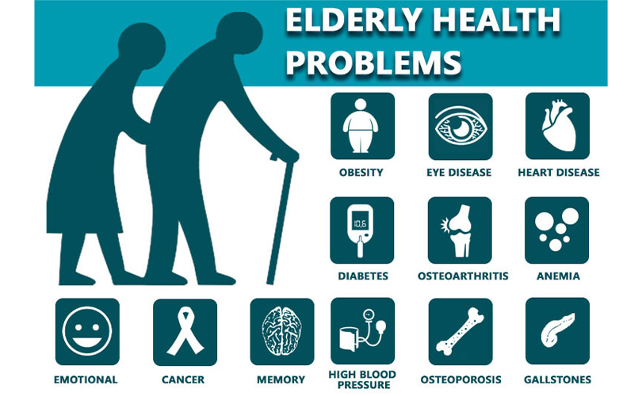

## Kaggle Identifying Age-Related Conditions
Bronce medal code for the Age related conditions Kaggle competition.  
Using a Xgboost model with cross validation  
[Link to competition](https://www.kaggle.com/competitions/icr-identify-age-related-conditions)

Image credits to drjatintalele.com/geriatric-diseases.php
  
  
On this repo I also have many other attempts that got worse score. Check the LGBM and the folder called "old".